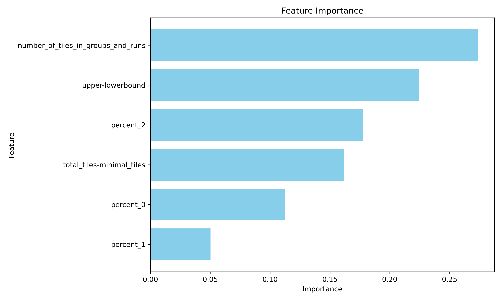
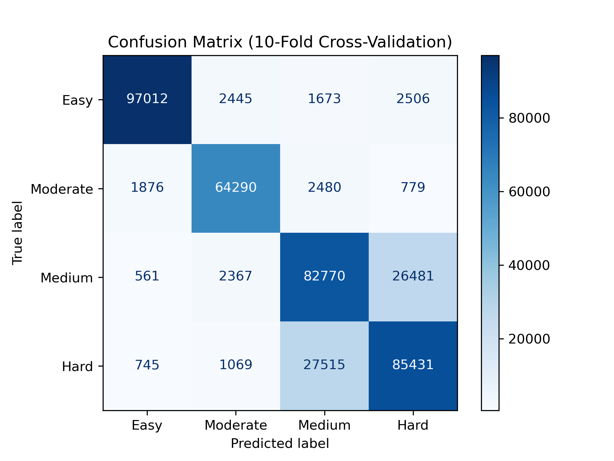

# Algorithms for Rummikub Puzzles

  

Code for my bachelor thesis **"Algorithms for Rummikub Puzzles"** (BSc Computer Science, LIACS, Leiden University, 2025).

A *Rummikub puzzle* is the one-player version of Rummikub. You get a set of tiles and lay out as many as possible in valid groups and runs to score the highest total value. This repository contains:

- a **C++ solver** that finds the maximum score, using recursion with memoization, pre-processing and lower/upper bounds;
- a **puzzle generator** in Python;
- a **difficulty classifier** (random forest) that predicts how hard a puzzle is from features you can compute *before* solving it;
- a check of the **closed formulas for the group value** derived in the thesis.

📄 **Thesis (PDF):** [theses.liacs.nl/pdf/2024-2025-WekkenMvanderMiguel.pdf](https://theses.liacs.nl/pdf/2024-2025-WekkenMvanderMiguel.pdf)  
👤 **Author:** Miguel van der Wekken · [LinkedIn](https://www.linkedin.com/in/miguelvanderwekken)

## The problem

The puzzle is a grid: every row is a tile value (1 to 100) and every column a color (black, green, red, yellow). Each tile appears 0, 1 or 2 times.

- **Group**: at least 3 tiles with the same value and different colors, e.g. `5g 5r 5y`
- **Run**: at least 3 consecutive values of the same color, e.g. `7b 8b 9b`
- A placed tile scores its value; tiles you cannot place score nothing.

**Input format:** the number of puzzles, then two lines per puzzle: the number of tiles, and the tiles themselves (value followed by the first letter of the color).

```
2
6
1b 2b 3b 5g 5r 5y
4
7b 8b 9b 9g
```

The solver prints one maximum score per puzzle:

```
21
24
```

## Approach

1. **Pre-processing.** Tiles that can never be part of a group or run are removed. The solver also computes a lower bound (the best of "groups only" and "runs only") and an upper bound. If the two are equal, the puzzle is already solved.
2. **Recursion over rows.** Starting at the highest value, the solver tries every combination of runs *ending* in the current row, for all four colors. It puts the remaining tiles of that row into groups (`group_value`, using the closed formula from the thesis) and continues with the row below. The search stops early once it reaches the upper bound.
3. **State encoding / memoization.** Which runs are still open in the last four rows determines everything below. Every open run covers the current row, so per color the open runs sum to at most *m* = 2: that gives C(m+4, 4) = 15 column states, and 15⁴ = 50,625 states for all four colors. The best value per (row, state) is stored, so each state is computed once.
4. **Clearable rows.** A row is *clearable* when all of its tiles fit in groups. Once only clearable rows remain, all remaining tiles score directly.
5. **Difficulty classification.** For every puzzle the solver can write six features: the gap between the bounds, the tile surplus, the percentages of tiles with 0/1/2 copies, and the number of tiles that fit in both a group and a run. Puzzles are labeled Easy/Moderate/Medium/Hard by solving time. In the thesis a random forest trained on 400,000 puzzles reached **82% accuracy** (10-fold cross-validation). Tiles that fit in both a group and a run were the most predictive feature.

| Feature importance | Confusion matrix |
|---|---|
|  |  |

The thesis derives closed formulas for the group value with any number of colors *k*, copies *m* and minimal set size *s*. The solver uses the formula for *s* = 3, and `scripts/group_value.py` checks the formulas against a greedy algorithm for every configuration.

## Quick start

Requirements: a C++11 compiler (`g++` or `clang++`), `make`, and Python 3.

```bash
make            # builds ./rummikub
make test       # solves examples/small.in and checks the group value formulas
```

Solve puzzles:

```bash
./rummikub examples/small.in
```

Full pipeline (generate → solve → classify):

```bash
pip install -r requirements.txt
python3 scripts/generate_puzzles.py mixed --count 2000 --seed 1 -o puzzles.in
./rummikub puzzles.in --features features.csv > scores.txt
python3 scripts/classify_difficulty.py features.csv --out-dir results
```

For fewer or more copies per tile, use fixed probabilities: `generate_puzzles.py fixed --p0 5 --p1 20` makes 5% of tiles absent and 20% single, and the rest double. Run any script with `--help` for all options. In `mixed` mode the first 10,000 puzzles are mostly easy; puzzles with few absent and few single tiles (e.g. `fixed --p0 5 --p1 5`) are the hard ones.

## Project structure

```
src/solver.cc                  solver + feature extraction (single file)
scripts/generate_puzzles.py    random puzzle generator
scripts/classify_difficulty.py random forest difficulty classifier
scripts/group_value.py         closed group value formulas vs. greedy algorithm
examples/                      small example set with expected scores
figures/                       results from the thesis
```

## Limitations

- The solver supports 4 colors, tile values up to 100 and at most 2 copies per tile.
- Jokers are not supported.
- Solving time grows quickly for puzzles with many single-copy tiles. Generating the full thesis training set (400,000+ puzzles) takes a long time.

## Acknowledgements

- Correctness was tested on the Rummikub test sets by the authors of *J.N. van Rijn, F.W. Takes and J.K. Vis, "The Complexity of Rummikub Problems", BNAIC 2015*. Those files are not included in this repository.

## License

[MIT](LICENSE) © 2025 Miguel van der Wekken
